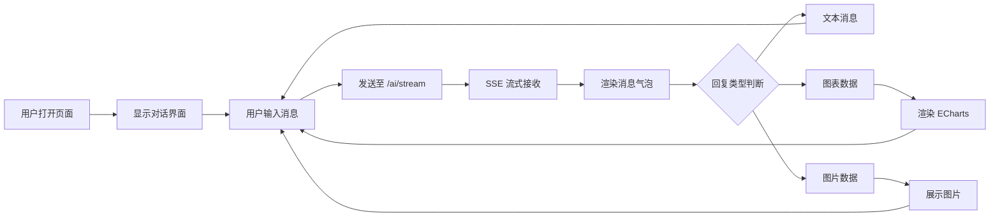

## 1. 产品概述

基于 Web 端豆包对话样式，为 AI 智能客服综合平台构建前端聊天界面，支持与后端 FastAPI 服务进行实时对话，包含多轮对话、流式输出、BI 图表展示、AI 生图等功能。

- 目标用户：需要使用 AI 智能客服进行对话、数据查询、报表查看的企业员工和管理人员
- 核心价值：提供类似豆包的高品质对话体验，让用户通过自然语言与业务系统交互

## 2. 核心功能

### 2.1 功能模块

1. **对话界面**：类豆包风格的多轮对话，支持 SSE 流式输出，消息气泡样式
2. **会话管理**：左侧边栏展示会话列表，支持新建/切换/删除会话
3. **BI 图表展示**：对话中通过自然语言查询生成图表（条形图、折线图、饼图）
4. **AI 生图**：对话中通过提示词生成宣传海报
5. **对话历史**：查看历史对话记录，继续之前的对话

### 2.2 页面详情

| 页面名称 | 模块名称 | 功能描述 |
|---------|---------|---------|
| 对话页 | 侧边栏 | 会话列表、新建会话、删除会话 |
| 对话页 | 消息区域 | 消息气泡渲染、Markdown 支持、代码高亮、流式打字效果 |
| 对话页 | 输入区域 | 多行输入框、发送按钮、快捷键（Enter 发送） |
| 对话页 | 图表展示 | 内嵌 ECharts 图表渲染 |
| 对话页 | 图片展示 | 内嵌 AI 生成的图片显示 |

## 3. 核心流程

用户打开页面 → 默认进入对话界面 → 输入消息 → 发送至后端 `/ai/stream` 接口 → SSE 流式接收回复 → 渲染消息气泡 → 如回复含图表数据则渲染 ECharts 图表 → 如回复含图片则展示图片

## 4. 用户界面设计

### 4.1 设计风格

- **主色调**：白色/浅灰背景，蓝色主题色 (#2563EB)，深色文字
- **按钮样式**：圆角矩形，悬浮阴影，渐变背景
- **字体**：系统字体栈，标题 16px，正文 14px
- **布局**：左侧边栏(280px) + 主内容区(自适应)，消息气泡布局
- **图标**：使用 SVG 图标，简洁干净

### 4.2 页面设计概览

| 页面名称 | 模块名称 | UI 元素 |
|---------|---------|--------|
| 对话页 | 侧边栏 | 会话列表、新建按钮、删除按钮、会话时间戳 |
| 对话页 | 消息区域 | 用户消息气泡(右对齐/蓝色)、AI 消息气泡(左对齐/白色)、头像、时间戳 |
| 对话页 | 输入区域 | 文本输入框、发送按钮、占位文字 |
| 对话页 | 头部 | 当前对话标题、设置按钮 |

### 4.3 响应式

- 桌面优先设计，最小宽度 900px
- 侧边栏可折叠，适配小屏场景
- 消息区域自适应高度

## 5. 技术要求

| 要求 | 说明 |
|------|------|
| 框架 | Vue 3 + Vite |
| 状态管理 | Pinia |
| 网络请求 | fetch API (SSE) + axios |
| 图表 | ECharts |
| Markdown | marked + highlight.js |
| 包管理 | npm |