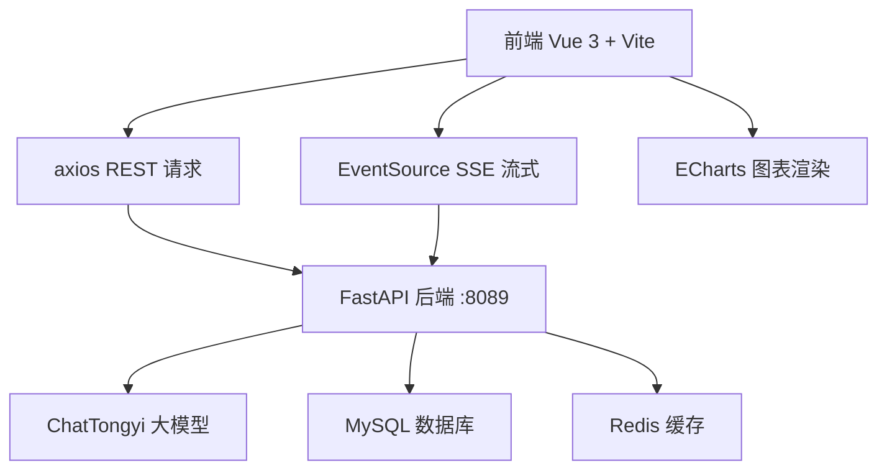

## 1. 架构设计



## 2. 技术描述

- **前端框架**：Vue 3 + Vite 5
- **状态管理**：Pinia（管理会话状态、消息列表）
- **HTTP 客户端**：原生 fetch (SSE) + axios (REST)
- **UI 组件**：无第三方 UI 库，纯手写样式
- **图表库**：ECharts 5
- **Markdown 渲染**：marked + highlight.js
- **初始化工具**：Vite 脚手架

## 3. 路由定义

| 路由 | 说明 |
|------|------|
| `/` | 主对话界面（单页应用，无路由跳转） |

## 4. API 定义

### 4.1 对话接口

- **普通对话**：`GET /ai/chat?msg=xxx&session_id=xxx`
  - 响应：`{ "response": "回复内容" }`
- **流式对话**：`GET /ai/stream?msg=xxx&session_id=xxx`
  - 响应：SSE 事件流，每帧为 token 文本
- **获取历史**：`GET /ai/history?session_id=xxx`
  - 响应：`{ "session_id": "xxx", "messages": [{ "messageType": "USER"/"ASSISTANT", "text": "xxx" }] }`
- **删除历史**：`DELETE /ai/history?session_id=xxx`
  - 响应：`{ "message": "删除成功" }`

### 4.2 BI 图表接口

- **图表查询**：`GET /ai/charts?text=xxx`
  - 响应：`{ "title": "xxx", "xAxis": [...], "series": [...], "labels": [...], "analysis": "xxx" }`

### 4.3 AI 生图接口

- **生成图片**：`GET /ai/image?prompt=xxx`
  - 响应：PNG 图片流

### 4.4 API 基础配置

```typescript
// 后端地址
const API_BASE = 'http://localhost:8089'

// 请求类型定义
interface ChatResponse {
  response: string
}

interface ChartData {
  title: string
  xAxis: string[]
  series: number[]
  labels: string[]
  analysis: string
}

interface ChatMessage {
  messageType: 'USER' | 'ASSISTANT'
  text: string
}
```

## 5. 组件结构

```
src/
├── App.vue                    # 根组件：布局容器
├── main.js                    # 入口文件
├── stores/
│   └── chat.js                # Pinia 状态管理
├── api/
│   └── index.js               # API 封装
├── components/
│   ├── Sidebar.vue            # 侧边栏组件
│   ├── ChatHeader.vue         # 对话头部
│   ├── ChatMessages.vue       # 消息列表
│   ├── ChatMessage.vue        # 单条消息气泡
│   ├── ChatInput.vue          # 输入区域
│   ├── ChartView.vue          # ECharts 图表渲染
│   └── ImageView.vue          # AI 图片展示
└── styles/
    └── main.css               # 全局样式
```

## 6. 状态管理

```typescript
// Pinia Store 定义
interface ChatState {
  sessions: ChatSession[]       // 会话列表
  currentSessionId: string      // 当前会话 ID
  messages: Message[]           // 当前消息列表
  isStreaming: boolean          // 是否正在流式接收
  isLoading: boolean            // 是否加载中
}

interface ChatSession {
  id: string
  title: string
  createdAt: string
}

interface Message {
  id: string
  type: 'user' | 'ai'
  content: string
  timestamp: string
  isStreaming?: boolean
}
```